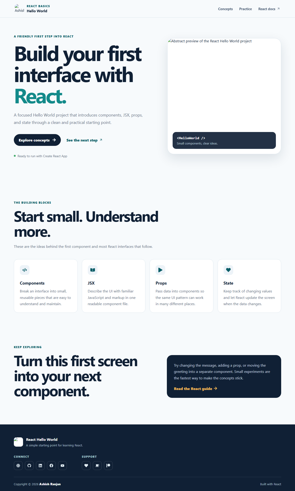

# React Hello World

A clean, responsive React starter that introduces components, JSX, props, and state through a small practical interface.



## Features

- Fixed responsive header with a mobile menu.
- Concept cards for the main React building blocks.
- Local branding assets and a floating go-to-top button.
- Icon-only social and support links in the footer.
- GitHub Pages deployment configuration.

## Tech stack

React, Create React App, CSS, and React Icons.

## Run locally

```bash
npm install
npm start
```

Create a production build with `npm run build`. Deploy to GitHub Pages with `npm run deploy`.

## Live

[Open the live project](https://a2rp.github.io/reactjs_hello_world/)

## Links

- Portfolio: [https://www.ashishranjan.net](https://www.ashishranjan.net)
- GitHub: [https://github.com/a2rp](https://github.com/a2rp)
- CodePen: [https://codepen.io/ash1198](https://codepen.io/ash1198)
- LinkedIn: [https://www.linkedin.com/in/aashishranjan](https://www.linkedin.com/in/aashishranjan)
- Facebook: [https://www.facebook.com/theash.ashish/](https://www.facebook.com/theash.ashish/)
- YouTube: [https://www.youtube.com/@ashishranjan-ashz?sub_confirmation=1](https://www.youtube.com/@ashishranjan-ashz?sub_confirmation=1)
- Email: [ash.ranjan09@gmail.com](mailto:ash.ranjan09@gmail.com)

## Support

- Support: [https://a2rp-donation-page.netlify.app/](https://a2rp-donation-page.netlify.app/)
- Buy Me a Coffee: [https://buymeacoffee.com/a2rp](https://buymeacoffee.com/a2rp)
- Patreon: [https://patreon.com/a2rp](https://patreon.com/a2rp)
